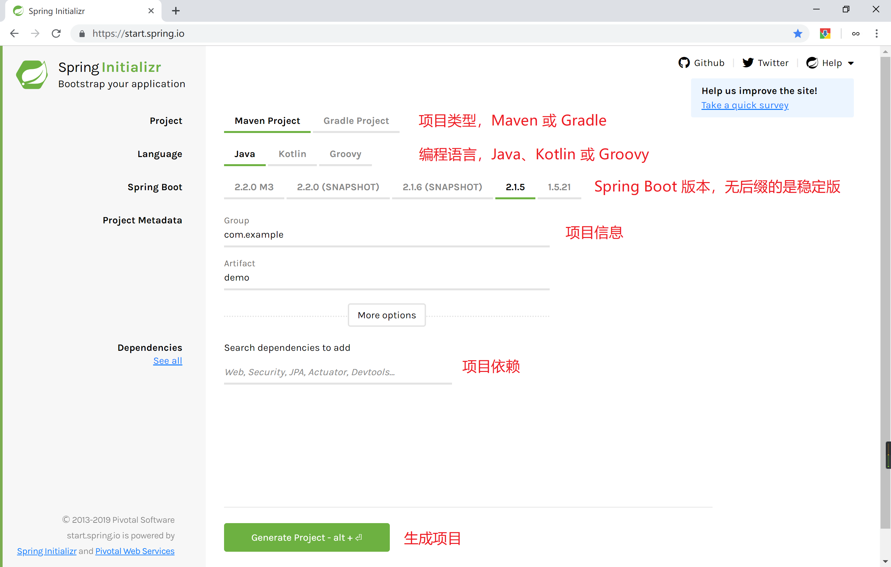
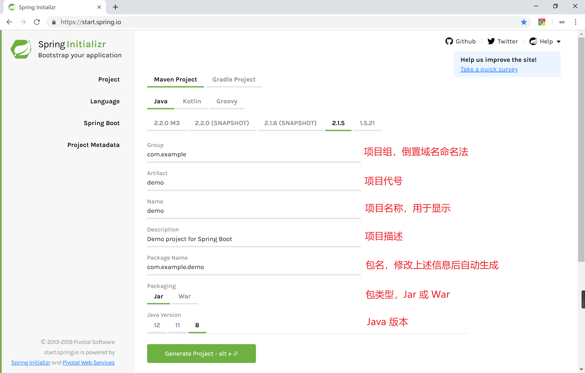
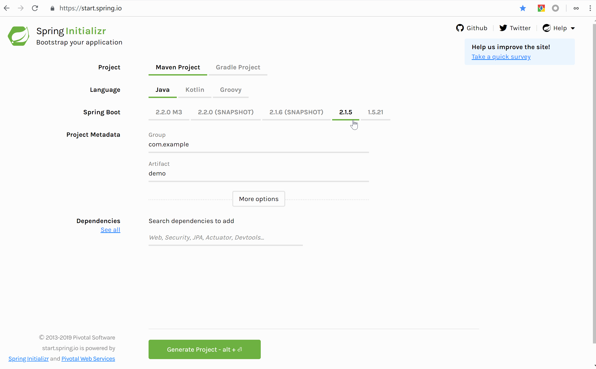
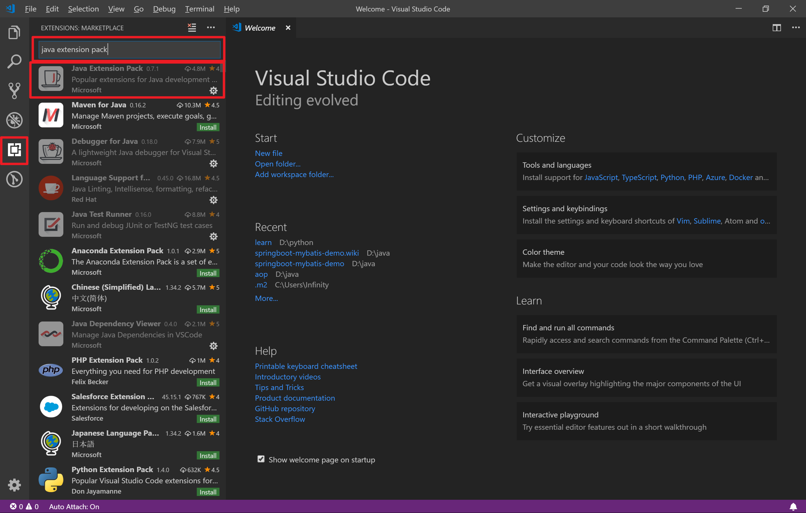
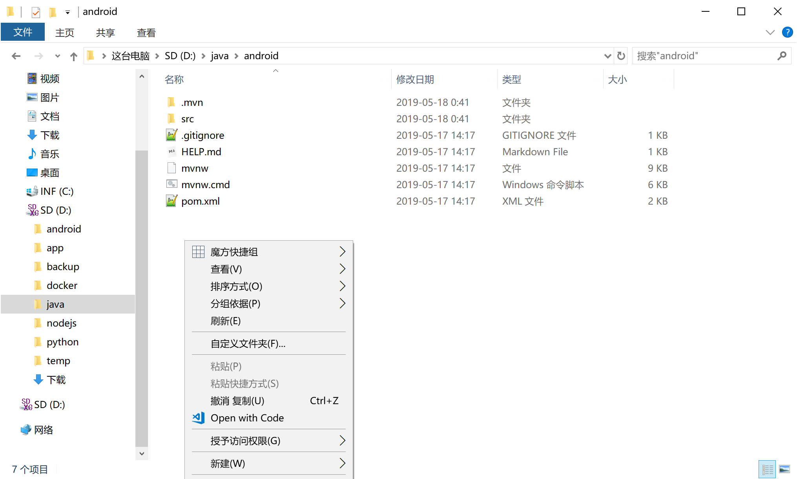
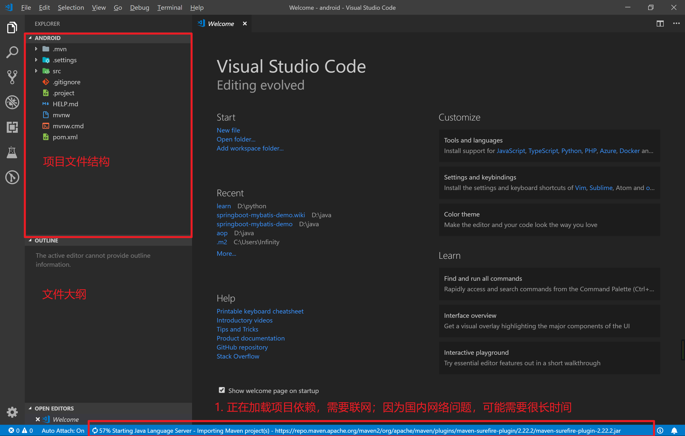
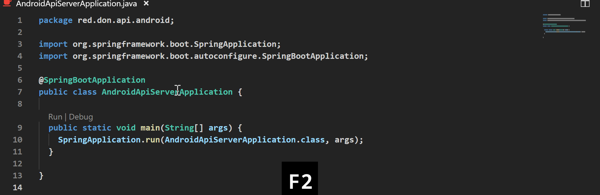
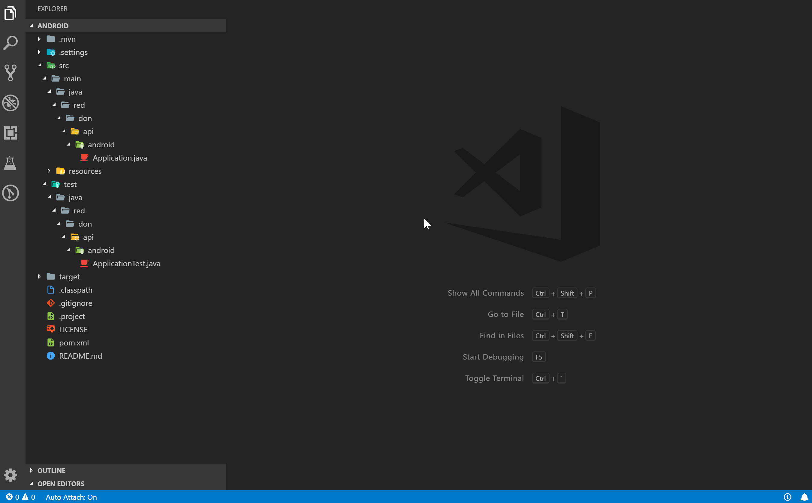
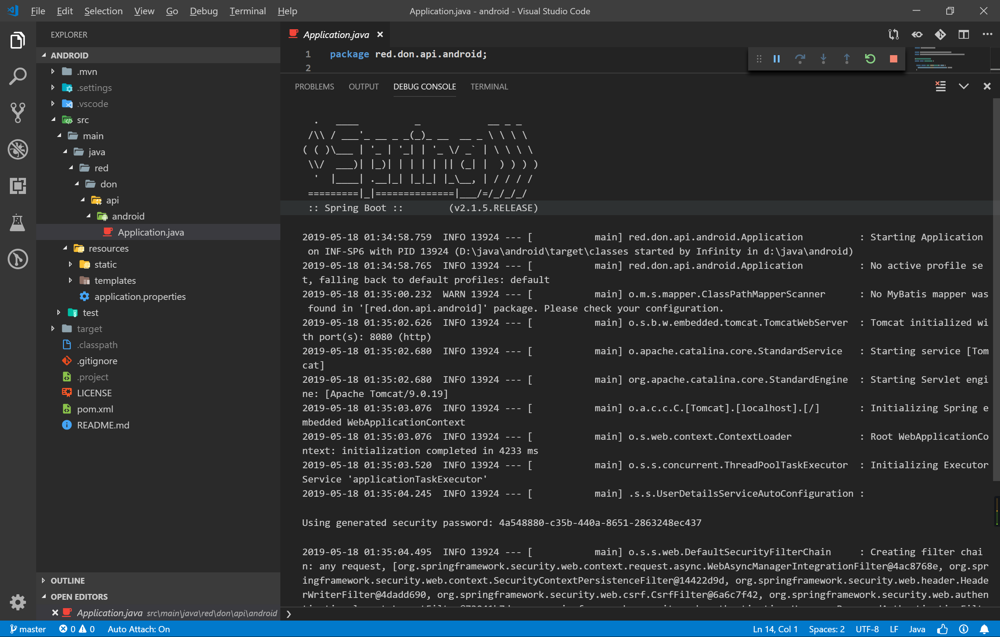

# Spring Boot 入门实战（一）：准备工作

# 项目信息

项目代码已托管至 [GitHub, https://github.com/DevinDon/android-api-server](https://github.com/DevinDon/android-api-server) ，[点击此处](https://github.com/DevinDon/android-api-server/tree/50a05b9cdc6ef319c2ef6f6a52f3e2aeaef73675) :point_left: 查看本章节内容。

# 创建项目

## Spring Initializr

Spring Boot 为我们提供了一个快捷的方式来创建项目：[Spring Initializr](https://start.spring.io/) :point_left: 。打开页面之后，可以看到如下内容：

- Project：项目类型，Maven 或 Gradle
- Language：编程语言，Java、Kotlin 或 Groovy
- Spring Boot：Spring Boot 版本，无后缀的是稳定版
- Project Metadata：项目信息
- Dependencies：项目依赖



点击 **More options** 展开所有选项，可以看到所有的项目属性 Project Metadata：

- Group：项目组，倒置域名命名法
- Artifact：项目代号，包含在包名中
- Name：项目名称，用于显示
- Description：项目描述
- Package Name：包名，修改上述信息后会自动生成
- Packing：打包类型，Jar 或 War
- Java Version：Java 版本



## 项目信息

### 项目组 Group

每一个项目都隶属于一个项目组，项目组的命名使用小写字母与数字，通常使用倒置域名命名法，如：`baidu.com -> com.baidu`、`music.163.com -> com.163.music` 。

本项目的项目组为：`red.don.api` 。

### 项目代号 Artifact

项目代号是项目在项目组中的代号，在本项目组唯一，但不同项目组可以有代号相同的项目，如：`com.baidu.music` 与 `com.163.music` 是不冲突的。项目代号的命名使用小写字母和数字。

本项目的项目代号为：`android` 。

### 包名 Package Name

为了准确地在 Maven 仓库中定位项目，每一个项目总有自己唯一的包名 Package Name，包名由项目组 Group 与项目代号 Artifact 构成。

本项目的包名为：`red.don.api.android` 。

### Java 版本

Java 版本需要根据开发环境及部署环境的 Java 版本而确定，在 Windows 上查看 Java 版本的方式如下：

1. 打开 Powershell 或 Command ；

2. 输入 `java --version` 或 `java -version` ；

3. 得到输出，并根据输出确定你的 Java 版本，如我的 Java 版本为 `11.0.2` ，Redhat OpenJDK：

   ```output
   PS C:\Users> java --version
   openjdk 11.0.2-redhat 2019-01-15 LTS
   OpenJDK Runtime Environment (build 11.0.2-redhat+7-LTS)
   OpenJDK 64-Bit Server VM (build 11.0.2-redhat+7-LTS, mixed mode)
   ```

## 项目依赖

本项目需要使用的依赖有：

- Aspects：Spring AOP 切面编程相关
- JJWT：JWT 相关（后续添加）
- MyBatis：MyBatis 持久层框架
- MySQL：MySQL ODBC
- Thyemleaf：模板服务
- Web：Spring Web 服务

## 下载项目

全部完成之后，点击底部的 **Generate Project** 下载项目，并解压。

## 操作示范

操作示范如下：



# 打开项目

本教程使用一款简洁强大又潮流的编辑器 [VSCode](https://code.visualstudio.com/) :point_left: 作为编辑器，你可以[点击此处下载安装](https://code.visualstudio.com/docs/?dv=win64user) :point_left: ，或者继续用 Eclipse 。

## 安装插件

如果你是第一次使用 VSCode ，请安装 Chinese 中文语言包，方法同下。

在使用强大的智能补全及联想提示之前，我们需要安装插件 Java Extension Pack ：



1. 点击左侧侧边栏的拓展选项卡；
2. 在输入框中输入 `Java Extension Pack` ；
3. 安装第一个插件；
4. 安装完成之后关闭 VSCode 。

确保你的电脑已经配置好了 JDK 环境。如果没有，建议请教幼儿园小朋友。

## 打开项目

进入刚刚解压好的目录下，右键选择 **Open with Code** ：



VSCode 界面如下：



首次打开项目需要联网加载项目依赖，由于国内网络问题，可能需要很长时间。可以考虑更换国内 Maven 仓库源，将本文件 [settings.xml](file/1/settings.xml) :point_left: 复制至 `C:\Users\你的用户名\.m2` 目录中即可。

## 目录结构

### 逻辑代码

源代码存放在 `src` 目录下，其中 `src/main` 目录下存放的是项目的逻辑代码。

### 测试代码

测试代码存放在 `src/test` 目录下。

### 项目信息

项目信息存放在 `pom.xml` 文件中，包含了上文提到的 Project Metadata 中的信息以及项目依赖信息。

## 优化项目（可选）

首先，我们来对项目做一些小小的优化。

### 优化命名

打开入口类 `src/main/java/red/don/api/android/AndroidApiServerApplication.java` ，右键类名 `AndroidApiServerApplication` 并重命名为 `Application` ：



使用同样的方法将测试类 `AndroidApiServerApplicationTests` 重命名为 `ApplicationTest` 。

### 移除无用文件

移除项目中的 `Help.md` `mvnw` 以及 `mvnw.cmd` 文件。

### 添加 README 和 LICENSE

在项目根目录创建 `README.md` 和 `LICENSE` 。

### 使用 Git 管理项目

键入 `Ctrl + ~` 打开控制台，在控制台输入 `git init` 来初始化版本管理库，并在左侧的版本管理选项卡中提交初始化版本：



## 配置项目

在测试运行之前，我们需要配置数据库连接，本项目使用的是我在阿里云服务器上提供的公共数据库服务。

将如下内容填至 `src/main/resources/application.properties` 中：

```properties
mybatis.type-aliases-package=red.don.api.server

spring.datasource.url=jdbc:mysql://a-1.don.red/shareddb
spring.datasource.username=shareduser
spring.datasource.password=shareduser
spring.datasource.driver-class-name=com.mysql.cj.jdbc.Driver
```

由于 `com.mysql.jdbc.Driver` 存在一些致命缺陷，所以 MySQL 重写了 MySQL 的 ODBC 驱动，包名为 `com.mysql.cj.jdbc.Driver` 。

如果你使用 Git 来管理项目，别忘了提交更改。

# 运行项目

打开入口类，点击入口方法 `main` 上方的 `Run` 按钮，即可在调试控制台中看到输出：



至此，项目已经能够正常运行，准备工作全部完成。

# 本章小结

本章主要讲解了使用 Spring Initializr 创建项目、配置 VSCode 并初始化项目以及初次运行项目。在随后的章节中，我们将会学习如何运用以往所学习的编程思想，来设计并实现一个功能齐备的后端服务器。

点击此处进入[《第二章：四层结构之实体层》](2-四层结构之实体层.md#项目信息)
