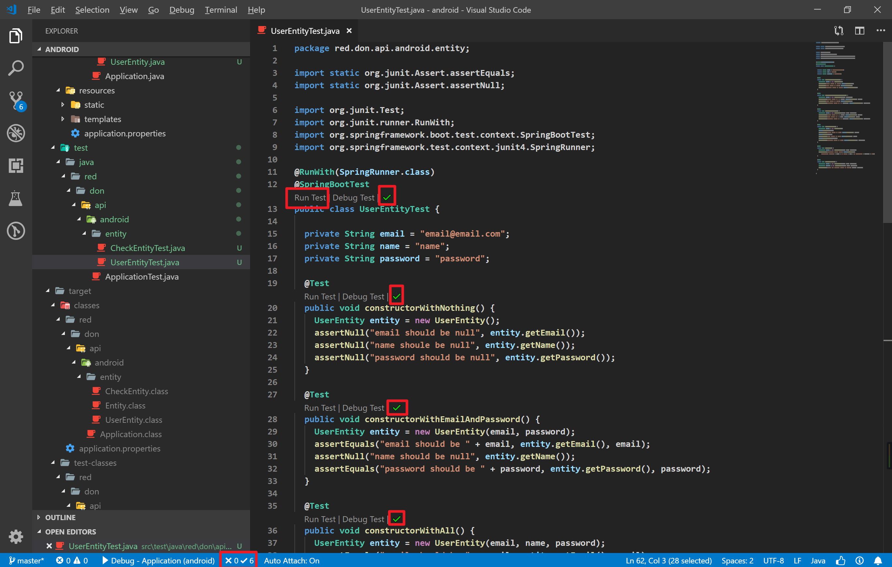

# Spring Boot 入门实战（二）：四层结构之实体层

# 项目信息

项目代码已托管至 [GitHub, https://github.com/DevinDon/android-api-server](https://github.com/DevinDon/android-api-server) ，[点击此处](https://github.com/DevinDon/android-api-server/tree/e4a60477b4f25b3755f4c62efe1887b42033d9e6) :point_left: 查看本章节内容。

本章教程我们将以四层结构的方式来对应用进行设计，实现代码的逻辑解耦与复用。

# 基础概念

在通常的 MVC 模式中，我们常常将应用划分为三层：Model 模型层、View 视图层 以及 Controller 控制层。但在实现前后端分离理念的后端服务中，**视图层 `View`** 仅用于传递数据，所以我们仅仅需要对 **模型层 `Model`** 和 **控制层 `Controller`** 进行设计即可。

## 四层结构

为了更加方便的对数据库进行操作，我们将 **模型层 `Model`** 划分为 **实体层 `Entity`** 与 **映射层 `Mapper`**；为了便于解耦复杂庞大的控制逻辑，我们将 **控制层 `Controller`** 原有的的业务逻辑抽离为 **服务层 `Service`** ，而现有的**控制层 `Controller`** 仅用于控制路径映射以及传递**视图 `View`** 数据。至此，我们便完成了后端服务四层结构的设计：

- 实体层 `Entity` ，将数据表 `Table` 转义为对象 `Object`
- 映射层 `Mapper` ，将数据库操作 `Operation` 映射为方法 `Method`
- 服务层 `Service` ，将业务功能封装为服务 `Service`
- 控制层 `Controller` ，将服务映射为外部可访问的 `API`

## 实体层

在讨论实体层之前，我们首先来聊聊 Object Relational Mapping, ORM 。

ORM 即对象关系映射，是一种程序技术，用于实现将其他系统中的数据类型转换为本系统中的数据类型。在数据库与编程语言中扮演翻译官的角色，将数据表翻译（映射）为代码中的对象。

而为了完成这种映射，我们需要四层结构中的最底层：实体层 `Entity` 。

实体层的别名有：模型层 `Model` 、对象转置层 `DTO, Data Transfer Object` ，目的是实现数据表到对象的转换 `Table -> Object` 。

实体层主要对应数据表实体，但也包含一些诸如数据响应的格式声明。

# 设计思路

## 用户表

根据业务逻辑分析，我们应当实现的主要功能有：登录、注册、签到，而所有的功能都是围绕用户展开的，首先应当设计一个用户表。用户表应有如下字段：

```java
public class UserEntity {
  /** 用户邮箱地址，主键 */
  private String email;
  /** 用户名 */
  private String name;
  /** 用户密码 */
  private String password;
}
```

由于注册邮箱是唯一的，所以我们不采用自增主键设计，而是将邮箱作为主键。

该表的 SQL 创建语句如下：

```sql
CREATE TABLE `user`  (
  `email` char(64) NOT NULL,
  `name` char(64) NULL DEFAULT NULL,
  `password` char(64) NOT NULL,
  PRIMARY KEY (`email`)
);
```

## 签到登记表

为了记录用户的签到信息，我们应当设计一个签到登记表。登记表的字段如下：

```java
public class CheckEntity {
  /** 签到编号 */
  private long id;
  /** 签到的用户邮箱地址，不使用外键 */
  private String user;
  /** 签到时间，Unix 时间戳，为了跨库兼容性以及业务灵活性，不考虑使用 MySQL TimeStamp 数据格式 */
  private long date;
}
```

不使用外键约束 `user` 字段，而是采用业务逻辑对其进行访问控制，提高效率，便于数据库操作。

该表的 SQL 创建语句如下：

 ```sql
 CREATE TABLE `check`  (
 `id` int(0) UNSIGNED NOT NULL AUTO_INCREMENT,
 `user` char(64) NOT NULL,
 `date` bigint(0) NOT NULL,
 PRIMARY KEY (`id`)
);
 ```

其中，该表的 `user` 字段与 `user` 表中的 `email` 字段相关联。

**:warning: 注意：这是一个非常简单的数据表设计，遵循极简设计的原则，不记录无关字段，也不对数据结构进行深度优化。如果你想要对数据表进行深度定制化设计，请自行查阅相关资料。**

完成数据表设计后，我们就可以着手实体层的创建工作了。

# 代码实现

## 创建 `Entity` 包

在目录 `src/main/java/red/don/api/android` 下创建一个名为 `entity` 的文件夹。

## 创建 `Entity` 基础接口

在目录 `src/main/java/red/don/api/android/entity` 下创建一个名为 [`Entity`](https://github.com/DevinDon/android-api-server/blob/e4a60477b4f25b3755f4c62efe1887b42033d9e6/src/main/java/red/don/api/android/entity/Entity.java) :point_left: 的接口：

```java
package red.don.api.android.entity;

import java.io.Serializable;

public interface Entity extends Serializable {

}
```

该接口的作用是将所有 Entity 实体进行类型声明，方便传参。

## 实现 `CheckEntity`

在目录 `src/main/java/red/don/api/android/entity` 下创建登记表实体 [`CheckEntity`](https://github.com/DevinDon/android-api-server/blob/e4a60477b4f25b3755f4c62efe1887b42033d9e6/src/main/java/red/don/api/android/entity/CheckEntity.java) :point_left: ，并实现 `Entity` 接口：

```java
package red.don.api.android.entity;

public class CheckEntity implements Entity {

  private static final long serialVersionUID = 1L;

  /** User ID, int, primary key. */
  private long id;
  /** User email, char(64), foreign key with `user`.`email`. */
  private String user;
  /** Check in date. */
  private long date;

  /** New empty check entity. */
  public CheckEntity() {
    this(0, null, 0);
  }

  /**
   * New check entity with user email & check in date.
   *
   * @param user User email.
   * @param date Check in date.
   */
  public CheckEntity(String user, long date) {
    this(0, user, date);
  }

  /**
   * New check entity with id, user email & check in date.
   *
   * @param id   Check record id.
   * @param user User email.
   * @param date Check in date.
   */
  public CheckEntity(long id, String user, long date) {
    this.id = id;
    this.user = user;
    this.date = date;
  }

  public long getId() {
    return id;
  }

  public void setId(long id) {
    this.id = id;
  }

  public String getUser() {
    return user;
  }

  public void setUser(String user) {
    this.user = user;
  }

  public long getDate() {
    return date;
  }

  public void setDate(long date) {
    this.date = date;
  }

  @Override
  public int hashCode() {
    final int prime = 31;
    int result = 1;
    result = prime * result + (int) (date ^ (date >>> 32));
    result = prime * result + (int) (id ^ (id >>> 32));
    result = prime * result + ((user == null) ? 0 : user.hashCode());
    return result;
  }

  @Override
  public boolean equals(Object obj) {
    if (this == obj)
      return true;
    if (obj == null)
      return false;
    if (getClass() != obj.getClass())
      return false;
    CheckEntity other = (CheckEntity) obj;
    if (date != other.date)
      return false;
    if (id != other.id)
      return false;
    if (user == null) {
      if (other.user != null)
        return false;
    } else if (!user.equals(other.user))
      return false;
    return true;
  }

  @Override
  public String toString() {
    return "CheckEntity [date=" + date + ", id=" + id + ", user=" + user + "]";
  }

}
```

完整代码请参阅 [`GitHub, src/main/java/red/don/api/android/entity/CheckEntity.java`](https://github.com/DevinDon/android-api-server/blob/e4a60477b4f25b3755f4c62efe1887b42033d9e6/src/main/java/red/don/api/android/entity/CheckEntity.java) 。

## 实现 `UserEntity`

在目录 `src/main/java/red/don/api/android/entity` 下创建用户实体 [`UserEntity`](https://github.com/DevinDon/android-api-server/blob/e4a60477b4f25b3755f4c62efe1887b42033d9e6/src/main/java/red/don/api/android/entity/UserEntity.java) :point_left: ，并实现 `Entity` 接口：

```java
package red.don.api.android.entity;

/** Entity: User. */
public class UserEntity implements Entity {

  private static final long serialVersionUID = 1L;

  /** User email, char(64), primary key. */
  private String email;
  /** User name, char(64). */
  private String name;
  /** User password, char(64). */
  private String password;

  /** Empty user. */
  public UserEntity() {
    this(null, null, null);
  }

  /**
   * New user with email & password.
   *
   * @param email    Email.
   * @param password Password.
   */
  public UserEntity(String email, String password) {
    this(email, null, password);
  }

  /**
   * New user with email, name & password.
   *
   * @param email    Email.
   * @param name     Name.
   * @param password Password.
   */
  public UserEntity(String email, String name, String password) {
    this.email = email;
    this.name = name;
    this.password = password;
  }

  public String getEmail() {
    return email;
  }

  public void setEmail(String email) {
    this.email = email;
  }

  public String getName() {
    return name;
  }

  public void setName(String name) {
    this.name = name;
  }

  public String getPassword() {
    return password;
  }

  public void setPassword(String password) {
    this.password = password;
  }

  @Override
  public int hashCode() {
    final int prime = 31;
    int result = 1;
    result = prime * result + ((email == null) ? 0 : email.hashCode());
    result = prime * result + ((name == null) ? 0 : name.hashCode());
    result = prime * result + ((password == null) ? 0 : password.hashCode());
    return result;
  }

  @Override
  public boolean equals(Object obj) {
    if (this == obj)
      return true;
    if (obj == null)
      return false;
    if (getClass() != obj.getClass())
      return false;
    UserEntity other = (UserEntity) obj;
    if (email == null) {
      if (other.email != null)
        return false;
    } else if (!email.equals(other.email))
      return false;
    if (name == null) {
      if (other.name != null)
        return false;
    } else if (!name.equals(other.name))
      return false;
    if (password == null) {
      if (other.password != null)
        return false;
    } else if (!password.equals(other.password))
      return false;
    return true;
  }

  @Override
  public String toString() {
    return "UserEntity [email=" + email + ", name=" + name + ", password=" + password + "]";
  }

}
```

`hashCode()` 方法用于生成对象的哈希值，可以用于比较。

`equals()` 方法用于比较两个对象是否相同。

**提示：**

1. `Getter` 和 `Setter` 可以自动生成，`右键 -> 源代码操作 -> Generate Getters & Setters...`
2. `toString()` 方法可以自动生成，`右键 -> 源代码操作 -> Generate toString()...`
3. `hashCode()` 方法和 `equals()` 方法可以自动生成，`右键 -> 源代码操作 -> Generate hashCode() and equals()...`

完整代码请参阅 [`GitHub, src/main/java/red/don/api/android/entity/UserEntity.java`](https://github.com/DevinDon/android-api-server/blob/e4a60477b4f25b3755f4c62efe1887b42033d9e6/src/main/java/red/don/api/android/entity/UserEntity.java) 。

至此，实体层已经全部实现。

# 单元测试

在完成逻辑代码后立即编写单元测试是一个优秀程序员的必备素养之一。

测试类需要添加两个类注解 `@RunWith(SpringRunner.class)` 以及 `@SpringBootTest` 来表明测试类的身份，如 [`ApplicationTest`](https://github.com/DevinDon/android-api-server/blob/e4a60477b4f25b3755f4c62efe1887b42033d9e6/src/test/java/red/don/api/android/ApplicationTest.java) :point_left: ：

```java
package red.don.api.android;

import org.junit.Test;
import org.junit.runner.RunWith;
import org.springframework.boot.test.context.SpringBootTest;
import org.springframework.test.context.junit4.SpringRunner;

@RunWith(SpringRunner.class)
@SpringBootTest
public class ApplicationTest {

  @Test
  public void contextLoads() {

  }

}
```

对实体类进行测试应当注意如下几个要点：

1. 构造方法是否能够正确对属性进行赋值；
2. 构造方法是否覆盖了所有属性；
3. `Getter` 和 `Setter` 方法能否正确地获取或设置属性值；
4. `Getter` 和 `Setter` 方法是否覆盖了所有属性；
5. `toString()` 方法是否符合预期输出；
6. `hashCode()` 和 `equals()` 能否正确地比较对象。

## 测试 `CheckEntity`

在测试目录 `src/test/java/red/don/api/android/entity` 下创建 [`CheckEntityTest`](https://github.com/DevinDon/android-api-server/blob/e4a60477b4f25b3755f4c62efe1887b42033d9e6/src/test/java/red/don/api/android/entity/CheckEntityTest.java) :point_left: 测试类。

### 测试构造函数

#### 构造函数：无参数

```java
@Test
public void constructorWithNothing() {
  CheckEntity entity = new CheckEntity();
  assertEquals("id should be 0", entity.getId(), 0);
  assertNull("user should be null", entity.getUser());
  assertEquals("date should be 0", entity.getDate(), 0);
}
```

#### 构造函数：用户邮箱 + 时间

```java
@Test
public void constructorWithUserAndDate() {
  CheckEntity entity = new CheckEntity(user, date);
  assertEquals("id should be 0", entity.getId(), 0);
  assertEquals("user should be " + user, entity.getUser(), user);
  assertEquals("date should be " + date, entity.getDate(), date);
}
```

#### 构造函数：全部属性

```java
@Test
public void constructorWithAll() {
  CheckEntity entity = new CheckEntity(id, user, date);
  assertEquals("id should be " + id, entity.getId(), id);
  assertEquals("user should be " + user, entity.getUser(), user);
  assertEquals("date should be " + date, entity.getDate(), date);
}
```

### 测试 `Getter` 与 `Setter`

```java
@Test
public void getterAndSetter() {
  CheckEntity entity = new CheckEntity();
  entity.setId(id);
  assertEquals("id should be " + id, entity.getId(), id);
  entity.setUser(user);
  assertEquals("user should be " + user, entity.getUser(), user);
  entity.setDate(date);
  assertEquals("date should be " + date, entity.getDate(), date);
}
```

### 测试 `toString`

```java
@Test
public void stringify() {
  CheckEntity entity = new CheckEntity(id, user, date);
  assertEquals("stringify should work", entity.toString(),
               "CheckEntity [date=" + date + ", id=" + id + ", user=" + user + "]");
}
```

### 测试 `equals`

```java
@Test
public void equalWithOther() {
  CheckEntity entity = new CheckEntity(id, user, date);
  CheckEntity another = new CheckEntity(id, user, date);
  assertEquals("these two entities shoule be equal", entity, another);
}
```

完整代码请参阅 [GitHub, src/test/java/red/don/api/android/entity/CheckEntityTest.java](https://github.com/DevinDon/android-api-server/blob/e4a60477b4f25b3755f4c62efe1887b42033d9e6/src/test/java/red/don/api/android/entity/CheckEntityTest.java) :point_left: 。

## 测试 `UserEntity`

在测试目录 `src/test/java/red/don/api/android` 下新建目录 `entity` ，并创建 [`UserEntityTest`](https://github.com/DevinDon/android-api-server/blob/e4a60477b4f25b3755f4c62efe1887b42033d9e6/src/test/java/red/don/api/android/entity/UserEntityTest.java) :point_left: 测试类。

### 测试构造函数

#### 构造函数：无参数

```java
@Test
public void constructorWithNothing() {
  UserEntity entity = new UserEntity();
  assertNull("email should be null", entity.getEmail());
  assertNull("name shoule be null", entity.getName());
  assertNull("password should be null", entity.getPassword());
}
```

#### 构造函数：用户名 + 密码

```java
@Test
public void constructorWithEmailAndPassword() {
  UserEntity entity = new UserEntity(email, password);
  assertEquals("email should be " + email, entity.getEmail(), email);
  assertNull("name should be null", entity.getName());
  assertEquals("password should be " + password, entity.getPassword(), password);
}
```

#### 构造函数：全部属性

```java
@Test
public void constructorWithAll() {
  UserEntity entity = new UserEntity(email, name, password);
  assertEquals("email should be " + email, entity.getEmail(), email);
  assertEquals("name should be " + name, entity.getName(), name);
  assertEquals("password should be " + password, entity.getPassword(), password);
}
```

### 测试 `Getter` 与 `Setter`

```java
@Test
public void getterAndSetter() {
  UserEntity entity = new UserEntity();
  entity.setEmail(email);
  assertEquals("email should be set", entity.getEmail(), email);
  entity.setName(name);
  assertEquals("name should be set", entity.getName(), name);
  entity.setPassword(password);
  assertEquals("password should be set", entity.getPassword(), password);
}
```

### 测试 `toString`

```java
@Test
public void stringify() {
  UserEntity entity = new UserEntity(email, name, password);
  assertEquals("stringify should work", entity.toString(),
               "UserEntity [email=" + email + ", name=" + name + ", password=" + password + "]");
}
```

### 测试 `equals`

```java
@Test
public void equalWithOther() {
  UserEntity entity = new UserEntity(email, name, password);
  UserEntity another = new UserEntity(email, name, password);
  assertEquals("these two entities should be equal", entity, another);
}
```

完整代码请参阅 [GitHub, src/test/java/red/don/api/android/entity/UserEntityTest.java](https://github.com/DevinDon/android-api-server/blob/e4a60477b4f25b3755f4c62efe1887b42033d9e6/src/test/java/red/don/api/android/entity/UserEntityTest.java) :point_left: 。

## 执行测试

在执行测试之前，你的工作区看起来应该像是这样：


点击测试类上方的 `Run Test` 按钮即可执行测试：



当测试执行成功后，会出现如图中红圈所示的绿色对勾；如果出现了红色的叉号，则代表测试未通过，点击叉号可以查看错误详情。

**:star: 提示：如果你使用 Git 来管理代码，别忘了提交修改。**

# 本章小结

本章讲解了四层结构的设计理念，并通过动手操作实现了实体层 `Entity` 的逻辑代码，并创建了相应的单元测试。

在接下来的章节中，我们将会讲到四层结构剩下的部分，通过实践来检验设计理念的合理性。

点击此处进入[《第三章：四层结构之映射层》](3-四层结构之映射层.md#项目信息)
